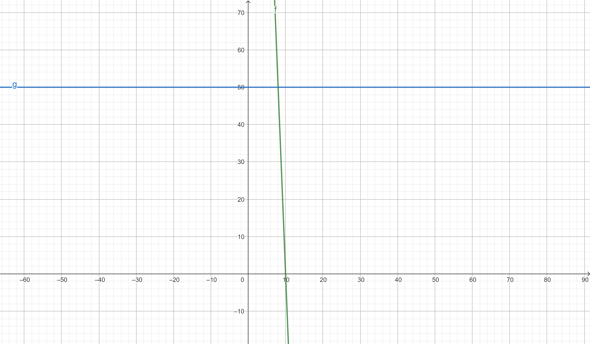

# Daily 17.09.24

## GA2 21W Codes


## Aufgabe zur Optimierung der Lagerhaltung 

[Optimierung der Lagerhaltung](<5 Aufgabe Optimierung der Lagerhaltung.pdf>)

### 1.   


### 2.
####  a) 
```
StundenSatz = 50
Dauer = 40
Sensoren = 10 * 20

result = (StundenSatz * Dauer) + Sensoren
result: 2200
```
#### b)
```
StundenSatz = 50
Dauer = 40
Sensoren = 10 * 20
Kosten_pro_RFID = 0.14
monatlicher_Wareneingang = 10000
InventurDauer_1Mon = 40
InventurDauer_2Mon = 8

fix = (StundenSatz * Dauer) + Sensoren
fix: 2200

result1 = StundenSatz * InventurDauer_1Mon
result1: 2000

result2 = (StundenSatz * (InventurDauer_2Mon / 2)) + monatlicher_Wareneingang * Kosten_pro_RFID
result2: 1600.0

Amortisation = fix / (result1 - result2)

Amortisation: 5.5

```
### 3.
#### a)
1. Alternativen heraussuchen   
2. Kriterien festlegen
3. Kriterien gewichten
4. Kriterien bewerten

#### b)
- Kosten
- Arbeitsaufwand
- Einführungsdauer
- Support/Wartung
- GUI
- Performance

### 4.
- Kranken-/Pflegeversicherung
- Rentenversicherung
- Arbeitslosenversicherung
- Kirchensteuer
- weitere vertragliche Leistungen

## Bestandsarten
[6 Bestandsarten.pdf](<6 Bestandsarten.pdf>)
### 1.
```
time = 1 + 2 + 1 + 1
time: 5

value_day = 250

min_Bestand = value_day * 3

min_Bestand: 750

res_Bestand = value_day * time

res_Bestand: 1250
```

### 2.


```
f(x) = 250 - 25x
y(x) = 50 

250 - 25x = 50
x = 8

24 / 8 = 3
```

