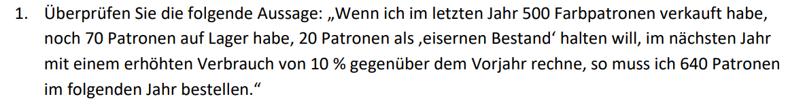
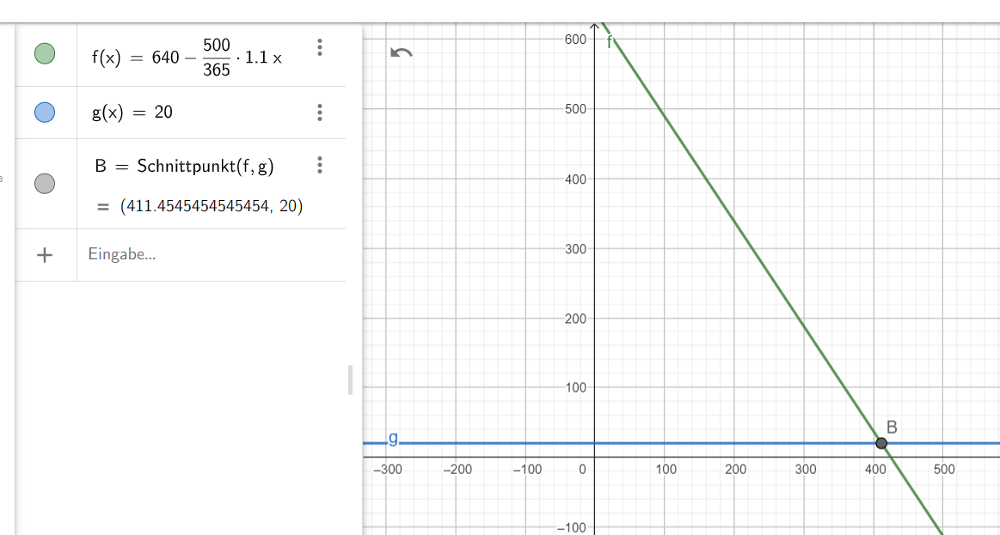
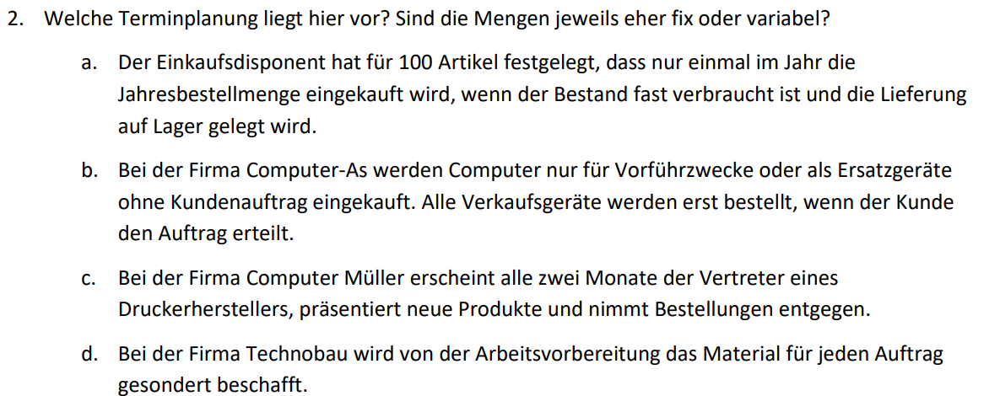

# Daily 24.09.24

## Bestellmengenplanung
[7 Bestellmengenplanung.pdf](<7 Bestellmengenplanung.pdf>)

### 1.

- Mit 640 Patronen hält der Bestand bei 10% höherem Verbrauch zum Vorjahr für ca. 411 Tage, also über ein Jahr
  - 

### 2.

- a)
  -> Bestellrhythmus Verfahren (fix)
- b)
  -> Einzelbeschaffung (variabel)
- c)
  -> Periodische Bestellung (variabel)
- d)
  -> fertigungssynchrone Beschaffung (variabel)

## 

