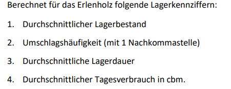
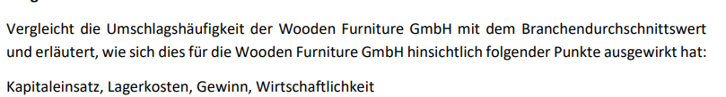
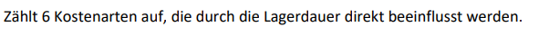
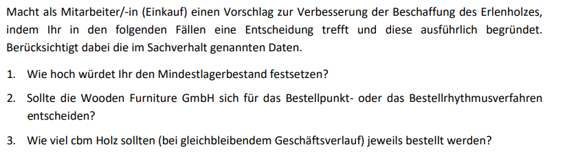

# Daily 01.10.24

## [Probleme im Lager und Lagerkennzahlen](<9 Probleme im Lager und Lagerkennzahlen.pdf>)

### Aufgabe 1

| Kennzahlen                | 2018 (31. Dez.) | 2019 (31. Dez.) | 2020 (31. Dez.) | 2021 (31. Dez.) |
| ------------------------- | --------------- | --------------- | --------------- | --------------- |
| Warenlager Gebäude        | 90.000,00 €     | 87.000,00 €     | 120.000,00 €    | 116.000,00 €    |
| Lagerbestand              | 280.000,00 €    | 285.000,00 €    | 330.000,00 €    | 350.000,00 €    |
| Wareneinsatz (Lagerware)  | 2.200.000,00 €  | 2.500.000,00 €  | 2.650.000,00 €  | 2.700.000,00 €  |
| Lagerkosten inkl. Schwund | 120.000,00 €    | 140.000,00 €    | 210.000,00 €    | 280.000,00 €    |
| Lagerumschlagshäufigkeit  | 7,9             | 8,8             | 8,0             | 7,7             |
| Lagerumschlagsdauer       | 46 Tage         | 42 Tage         | 45 Tage         | 47 Tage         |
| Lagerkostensatz zum WE    | 5,5 %           | 5,6 %           | 7,9 %           | 10,3 %          |

```math
\\einsatz = 2700000.00
\\start_bestand = 330000.00
\\end_bestand = 350000.00
\\l_cost = 280000.00
\\approx_bestand = 350000
\\
\\umschlag_count = (einsatz / approx_bestand)
\\einsatz_pro_we = (l_cost / einsatz)
\\einsatz_pro_we: 0.1037037037037037
\\umschlag_count: 7.714285714285714
\\
\\umschlag_dauer = 365 / umschlag_count
\\
\\umschlag_dauer: 47.31481481481482
```


### Aufgabe 2
Hoher Wareneinsatz bei einem geringem Lagerbestand ermöglichen es einem Discounter, eine extrem hohe Lagerumschlagshäufigkeit zu erreichen.
Durch diese Strategie können Discounter extrem schnell auf den Markt bzw. die aktuelle Nachfrage reagieren.

## [Fallbearbeitung](<9 Fallbearbeitung.pdf>)

| Lagerbestände - Erlenholz - | Anfangsbestand    | 280.000 € |           |
| --------------------------- | ----------------- | --------- | --------- |
|                             | Monatsendbestände |           |           |
| Januar                      | 260.000 €         | Juli      | 213.000 € |
| Februar                     | 274.000 €         | August    | 417.000 € |
| März                        | 401.000 €         | September | 300.000 € |
| April                       | 422.000 €         | Oktober   | 39.000 €  |
| Mai                         | 118.000 €         | November  | 449.000 € |
| Juni                        | 189.000 €         | Dezember  | 278.000 € |


### Aufgabe 1


1. $\def*{\cdot} 280000 $

2. $\def*{\cdot} 3.6 $

3. $\def*{\cdot} 101 $ Tage

4. $\def*{\cdot} 6.28 $


```math
\\einsatz = 1012000
\\start_bestand = 280000
\\end_bestand = Error: Undefined symbol end_bestand
\\l_cost = Error: Undefined symbol l_cost
\\
\\% approx_bestand = (start_bestand + end_bestand) / 2 Error: Value expected (char 1)
\\approx_bestand = (start_bestand +  260000 + 274000 + 401000 + 422000 + 118000 + 189000 + 213000 + 417000 + 300000 + 39000 + 449000 + 278000) / 13
\\umschlag_count = (einsatz / approx_bestand)
\\einsatz_pro_we = (l_cost / einsatz) Error: Undefined symbol l_cost
\\einsatz_pro_we: 0.1037037037037037 Error: Undefined symbol einsatz_pro_we
\\umschlag_count: 3.6142857142857143
\\
\\umschlag_dauer = 365 / umschlag_count
\\
\\umschlag_dauer: 100.98814229249012
\\
\\approx_bestand: 280000
\\
\\approx_daily = ((280000 * 3.6) / 440) / 365
\\
\\approx_daily: 6.276463262764633

```

### Aufgabe 2



- **Kapitaleinsatz**
  - Hoher -> mehr Kapital im Lager gebunden
- **Lagerkosten**
  - Höher -> Längere Lagerung größere BEstände
- **Gewinn**
  - Geringer -> Höhere Kosten, mehr gebundenes Kapital
- **Wirtschaftlichkeit**
  - Geringer -> Ressourcen werden ineffizienter genutzt

### Aufgabe 3

- Lagerhaltung
- Kapitalbindung
- Lagerraum
- Versicherung
- Wertminderung (Veralterung)
- Schwund 

### Aufgabe 4


1.
2.
3.

## Projekt Ideen
**Cloud-basierte File Storage und Sharing Plattform**
- **Projektidee**: Baue eine Cloud-basierte Plattform wie Google Drive oder Dropbox, auf der Nutzer Dateien speichern und teilen können, mit Funktionen wie Zugriffskontrolle und Kollaboration in Echtzeit.
- **Technologien**: AWS, Google Cloud, Docker, Kubernetes, Node.js.

**Gamification-Application für Work Productivity**
- **Projektidee**: Baue eine Gamification-App, die alltägliche Aufgaben in ein spielerisches Erlebnis verwandelt. Nutzer könnten Belohnungen und Fortschritte für das Erreichen von Zielen wie Weiterbildungen oder Produktivität erhalten.
- **Technologien**: React Native, Flutter, Firebase.