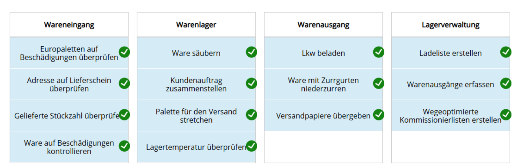
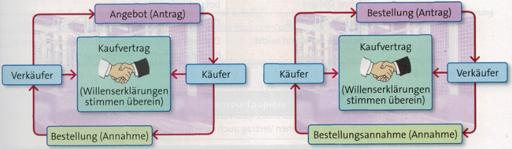
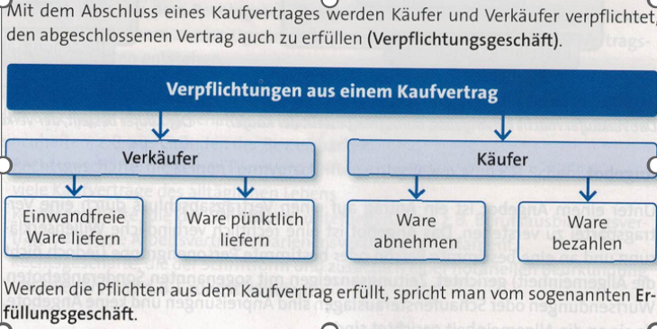
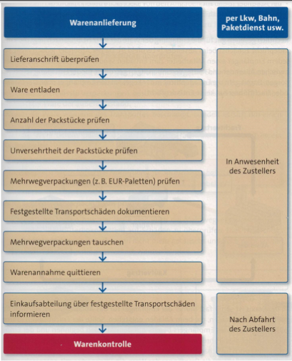
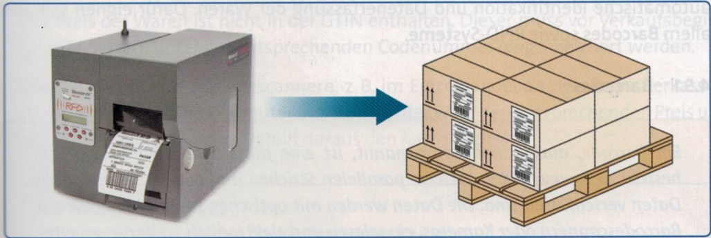
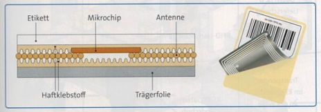
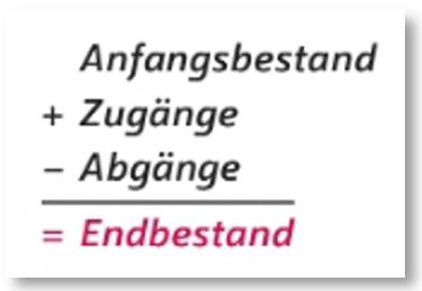
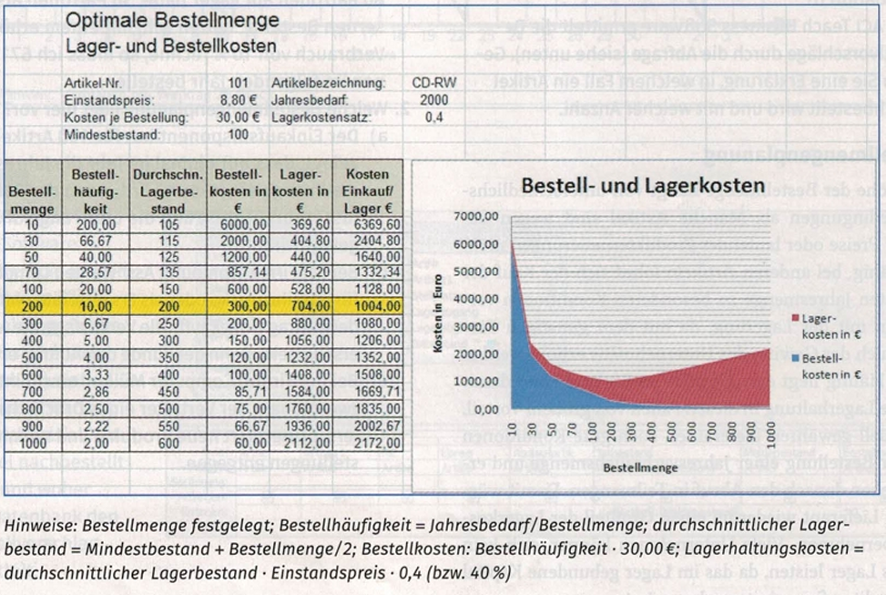

# Vorbereitung KA 29.10.24

## Themen

- 0: Logistik und Lagerlogistik
- 1: Bestellung und Warenannahme
- 2: Warenkontrolle und mangelhafte Lieferung
- 3: Einlagerung von Waren und Codierungen
- 4: RFID-Technik
- 5: Optimierung der Lagerhaltung
- 6: Bestandsarten
- 7: Bestellmengenplanung
- 8: Optimale Bestellmenge
- 9: Probleme im Lager und Lagerkennzahlen

## 0: Logistik und Lagerlogistik

- **Logistik**
  -> ... beschreibt übergreifend die **strategischen** und **operativen** Prozesse in einem Unternehmen, um den Waren-, Informations- und/oder Ressourcenfluss sicherzustellen. Hierbei wird in der Regel versucht, die **Effizienz** und die **Qualität** so hoch wie möglich und die **Kosten** so gering wie möglich wie möglich zu halten.
- **strategische Prozesse**
  -> ... beschreiben alle Prozesse für die **langfristigen** **Planungen** in einem Unternehmen.
  Dazu zählt zB. die **Standortplanung**, die **Wahl** **des** **Lieferanten** oder **Technologieinvestitionen**.
- **operative** **Prozesse**
  -> ... beschreiben Prozesse in **alltäglichen** **Abläufen** **und** **Aktivitäten**.
  Beispiele hierfür wären zB. **Bestandsmanagement**, **Verpackung** oder **Qualitätsmanagement**.
- **Lagerlogistik**
  -> ... beschreibt den Teilbereich der Logistik, der für den optimalen **Warenfluss** und die **Platzverwaltung** im Lager zuständig ist.
  Hierzu zählen **Bestandskontrollen**, **Erfassung im Wareneingang** oder effizientes **Verstauen der Materialien**.
- Tätigkeiten in der Lagerlogistik
  

## 1: Bestellung und Warenannahme

- **Kaufvertrag**
  -> Das vollständige Abschließen eines Kaufvertrages setzt in jedem Fall eine **bindende Willenserklärung (Antrag und Annahme)** beider Vertragspartner voraus.
  Im Fall eines privaten Kaufes macht idR. Der Verkäufer ein Angebot, zu welchen Konditionen ein bestimmtest Produkt angeboten wird (Antrag).
  Der Käufer willigt anschließend ein, dass Produkt zum angegebenen Preis zu erwerben (Annahme) und der Kaufvertrag ist abgeschlossen.
  Im Fall eines Unternehmens geht der Antrag häufig vom Käufer aus. Dieser Bestellt beim Lieferanten zu zuvor vereinbarten Konditionen das Produkt. Mit der Annahme der Bestellung vom Verkäufer ist auch hier der Kaufvertrag abgeschlossen.
  **Wichtig**: Ändert eine der Seiten in diesem Fall die vorab vereinbarten Konditionen, dann bedarf es ein weiteres Mal die Einwilligung beider Vertragspartner!
  
- **Warenannahme**
  -> Erst wenn der Käufer die Ware angenommen hat, ist der Kaufvertrag vollständig abgeschossen. Während es für Privatkunden möglich ist, innerhalb der **Gewährleistung** eventuelle Mängel an einer Lieferung geltend zu machen, muss dies bei geschäftlichen Kunden **unverzüglich** geschehen.
  Es ist daher für Unternehmen essentiell eine Lieferung vor der Annahme auf Mängel zu prüfen.

  
  
  

## 2: Warenkontrolle und mangelhafte Lieferung

- **Stichprobenkontrollen**
  -> ... sind sehr effizient um große Lieferungen mit möglichst geringem Zeit- und Kostenaufwand zu prüfen.
  Sie sind sinnvoll, bei sehr großen Mengen oder Waren bei denen nur mit geringer Wahrscheinlichkeit Mängel auftreten.
  Beispiele wären elektronische oder mechanische Bauteile. Bei der Stichprobenkontrolle besteht allerdings das Risiko, dass eine Fehlerhafte Charge unentdeckt bleibt da die gewählten Proben in ihrer Anzahl oder Auswahl nicht repräsentativ genug sind.
- **Vollständige Prüfungen**
  -> ... sind vor allem bei sicherheitskritischen oder fehleranfälligen Produkten sinnvoll.
  In zB. der Medizin- oder Automobilbranche, kann die Weiterverarbeitung auch nur eines einzigen fehlerhaften Teils fatale Auswirkungen haben.
  Da diese Art der Kontrolle sehr kosten- und zeitaufwendig werden kann, wird sie idR. nur auf besonders kritische Produkte beschränkt und nicht Unternehmensweit angewendet.
- **Gewährleistung**
  -> ... beschreibt eine **gesetzlich vorgeschriebene** Frist von **2 Jahren**, in der der Verkäufer für Mängel am Produkt haftet, die vor der Übergabe an den Käufer bestanden. Die Gewährleistung gilt **nur für Privatkunden**!
- **Garantie**
  -> ... beschreibt eine **freiwillige Leistung** des Verkäufers, individuell vertraglich definierte Mängel am Produkt über die gesetzliche Gewährleistung hinaus zu beseitigen.
- **Kulanz**
  -> ... beschreibt die **freiwillige Leistung** des Verkäufers, nach **Ablauf von Gewährleistung und Garantie**, weitere Mängel am Produkt zu beseitigen oder Reparaturen durchzuführen.

### Verhalten im Fall eines Mangels (Unternehmen)

1. **Mängelrüge**

   - Der Käufer sollte einen Mangel am Produkt oder einer Lieferung umgehend schriftlich rügen, also dem Verkäufer mitteilen.
     Abhängig von den zuvor festgelegten Vertragsbedingungen, legt der Käufer hier eine Frist (zB. 14 Tage) fest, in welcher der Verkäufer reagieren muss.
2. **Nacherfüllung**

   - Innerhalb der vereinbarten Frist hat der Verkäufer die Möglichkeit der Nachbesserung (Reparatur) oder Ersatzlieferung.
     Schlägt der zweite Nachbesserungsversuch fehl oder ist die Ersatzlieferung in einem unzumutbaren Zustand, kann der Käufer die Nacherfüllung auch ablehnen.
3. **Rücktritt oder Minderung**

   - Wird die Nacherfüllung nicht innerhalb der Frist geleistet oder schlägt fehl, so kann der Käufer Kaufpreisminderung fordern. Bei erheblichen Mängeln ist es dem Käufer zudem möglich vollständig vom Kaufvertrag zurück zu treten und somit den gesamtem Kaufpreis erstattet zu bekommen.
4. **Schadensersatz**

   - Vor Allem im Fall eines Unternehmen kann aus einer mangelhaften Lieferung zudem ein wirtschaftlicher Schaden entstehen. In diesem Fall hat der Käufer zudem Anspruch auf **Schadensersatz**. Dies kann passieren wenn die gelieferte Ware anderweitig zu einem erhöhten Preis erworben werden musste oder die verzögerte Lieferung Produktionsausfälle zur Folge hatte.

## 3: Einlagerung von Waren und Codierungen

### Schritte bei der Einlagerung

- **Erstellung eines Wareneingangsscheins**
  -> Artikel, Anzahl, Datum etc. wird im System festgehalten
- **Bildung logischer Einheiten**
  -> Die angelieferte Ware wird in zuvor festgelegten Einheiten eingelagert. Je nach Artikel kann diese per Anzahl, Gewicht oder Volumen definiert sein.
- **Kennzeichnung**
  -> Jede Ware oder logische Einheit wird zur späteren Identifizierung mit einer Wareneingangsnummer versehen. Diese wird anschließend in Form zB. eines Barcodes auf den Artikel gedruckt oder geklebt.
- **Bestandserfassung**
  -> Die eingelagerte Ware wird dem mit aktuellen Gesamtbestand der Ware im Lager addiert.
- **Freigabe und Transport**
  -> ... der neu angelieferten Waren zum vorgesehenen Lagerort bzw. in das vorgesehene Lager

### Codierung

Zur besseren Nachverfolgung wird jede Ware im Lager mit einer Nummer versehen und diese auch physisch auf der Ware angebracht. Damit diese Nummer möglichst automatisiert eingelesen werden kann, erfolgt dies häufig in Form eines Barcodes.
Es gibt verschiedene Systeme um eine Zahlenkombination als Barcode zu exportieren ([Tabelle mit Codierungen](../24.09.10/3 Tabelle mit Codierungen.docx)), zB. GTIN, GS1-Presscode oder Code 128. Bei nahezu allen dieser Codierungen werden die Zahlen zuvor in Binär umgewandelt, um sie mit kurzen und breiten Strichen (1 und 0) darzustellen. Anschließend werden die Nummern mit einer Prüfziffer versehen.
Die Prüfziffer wird aus den vorangegangenen Ziffern berechnet. Anschließend gleicht das Lesegerät die berechnete Nummer mit der tatsächlichen Prüfziffer auf dem Barcode ab, um sicherzustellen das die restliche Zahl korrekt gelesen wurde.

Im Fall von 'Data Matrix Codes' wie dem QR-Code (Quick Response), ist es durch diese Prüfziffern möglich, große Teile des QR-Codes aus der Prüfsumme heraus wiederherzustellen. Dies ist möglich, da die Prüfziffer mehrfach auf QR-Code hinterlegt ist und sich so von der Prüfziffer auf die tatsächliche Information rückschließen lässt.

## 4: RFID-Technik

RFID (Radio Frequency Identification) ermöglicht die Identifizierung von Waren, bzw. das Lesen der Warennummer ohne direkten Sichtkontakt zum Objekt.

Hierzu sendet ein Lesegerät elektromagnetische Wellen aus, die via Induktion einen kleinen Stromkreis in dem RFID-Etikett anstoßen. Diese Schwächt anschließend das Magnetfeld des Lesegerätes auf eine Solche Weise, dass es dadurch die Warennummer herleiten kann (ähnlich wie Morsecode)

Mit der RFID-Technik ist es so möglich, eine sehr große Anzahl an Waren, auf einmal einzulesen, ohne direkten Sichtkontakt mit dem Lesegerät sicherzustellen.

## 5: Optimierung der Lagerhaltung

## 6: Bestandsarten

- **Skontrationsmethode**
  -> ... , manchmal auch **Fortschreibungsmethode**, beschreibt das grundsätzliche Vorgehen in der Lagerbuchung.
  Hierbei werden zum anfänglichen Bestand alle Zugänge addiert und anschließend alle Abgänge abgezogen. Das Ergebnis entspricht somit dem neuen Endbestand im Lager.
  
- **EDV-Lagerverwaltungssysteme**
  -> ... beschreibt eine Software um Wareneingänge, Lagerorte, Bestände usw. zu verwalten. In der Vergangenheit wurden hierzu Lagerkarten und Lagerfachkarten genutzt, nur wenige Firmen nutzen diese noch ergänzend zum Computersystem.
- **Soll-Bestand**
  -> ... beschreibt den Bestand im Lager, der bei ordnungsgemäßen Ein- und Ausgängen aktuell im Lager verfügbar sein sollte. Der physisch tatsächliche Bestand im Lager wird daher als **Ist-Bestand** bezeichnet. Er wir manchmal auch als **Inventurbestand** bezeichnet, da er nur durch diese ermittelt werden kann.
- **Höchstbestand**
  -> ... beschreibt den Bestand der pro Artikel maximal auf Lager vorrätig liegen darf. Dieser wird vom Unternehmen festgelegt, um Kosten und Kapitalbindung zu vermeiden. Er muss jederzeit vom Einkäufer beachtet werden.
- **Mindestbestand**
  -> ... beschreibt den Bestand der pro Artikel mindestens auf Lager vorrätig liegen muss. Er muss bei Störungen zB. der Lieferkette, die Versorgung für Produktion und Kunden sichern. Er darf nur mit Weisung der Unternehmensleitung unterschritten werden und wird daher auch **Reservebestand**, **Sicherheitsbestand** oder als **eiserne Reserve** bezeichnet.
- **Störungen durch Lieferanten**

  - Lieferverzögerung
  - Transportschwierigkeiten
  - Falschlieferung
  - fehlerhafte Teile
  - zu geringe Stückzahl
- **Störungen durch Unternehmen**

  - unerwartete Verbrauchsschwankung ...
    - durch Mehrverkauf/Mehrverbrauch
    - durch Differenzen zwischen Soll- und Ist-Bestand
- **Meldebestand**
  -> ... beschreibt die Bestandsgrenze pro Artikel, bei bei dem automatisch eine neue Bestellung ausgelöst wird. Er wird manchmal auch als **Bestellpunkt** oder **Signalzahl** bezeichnet. Bei diesem Wert ist es wichtig, dass der Artikel noch so ausreichend auf Lager ist, dass bei aktuellem Verbrauch, die Beschaffungs- bzw. Lieferzeit überbrückt werden kann.
- **verfügbarer Bestand**
  -> ... beschreibt den tatsächlichen Bestand im Lager, der nicht bereits für andere Zwecke verplant ist. Also nicht zB. bereits für Produktion oder Verkauf eingeplant wurde.
  

## 7: Bestellmengenplanung

### Formen der Bestellmengenplanung

- **feste Bestellmenge**
  -> Abhängig von Tagesverbrauch und Lieferzeit wird eine feste Bestellmenge festgelegt. Dabei ist der Bestelltermin variabel und wird durch das erreichen des Meldebestands ausgelöst.
- **variable Bestellmenge**

  - Wenn der Verbrauch sehr stark variiert, dann kann es sich lohnen die Bestellmenge variabel zu setzten. Dann ist idR. ein fester Bestelltermin gesetzt und die Menge abhängig von zuvor berechneten Absatzvorhersagen.

### Verfahren der Bestellmengenplanung

- **Bestellpunktverfahren**
  -> ... beschreibt die Bestellung nach Erreichen eines zuvor bestimmten Lagerbestandes (Meldebestand).
  zB. "Kleinartikel wie Schrauben im Baumarkt werden nachgekauft sobald der Bestand unter 500 Stück fällt".
- **Bestellrhythmusverfahren**
  -> ... beschreibt das periodische Nachbestellen in zuvor festgelegten Zeitabständen.
  zB. "Ein Lebensmittelgeschäft bestellt jeden Montag und Mittwoch frisches Obst und Gemüse."
- **fertigungssynchrone Beschaffung**
  -> Die Bestellung von Artikeln erfolgt in Abstimmung mit dem Produktionsplan.
  zB. "Ein Automobilhersteller bestellt Reifen so, dass sie dann ankommen, wenn sie für die Montage benötigt werden."
- **Einzelbeschaffung**
  -> Bestellungen erfolgen nur im Bedarfsfall.
  zB. "Ein Möbelhaus bestellt einen exklusiven Tisch nur nach, sollte ein Kunde ihn bestellt haben."

### Faktoren für die Bestellmenge

- **Beschaffungsart**
  -> Kann der Artikel über längere Zeit gelagert werden?
  Bei vielen Lebensmitteln oder medizinischen Produkten lohnt es sich nicht eine hohe Anzahl auf Lager zu haben, da diese zu verderblich sind.
- **Beschaffungsbedarf**
  -> Besteht ohnehin ein sehr großer Bedarf am Artikel, so kann es sich lohnen bereits zu Jahresbeginn den gesamten Jahresvorrat im Lager zu haben. Der Verwaltungsaufwand für eventuelle Nachbeschaffungen sinkt und Lieferanten können für sehr große Abnahmen erheblichen Rabat berechnen.
- **Bank- bzw. Lieferantenkredit bzw. Bankstatus / Beschaffungskosten**
  -> Muss ein Unternehmen bereits hohe Kredite aufnehmen, um eine Lieferung bezahlen zu können so kann es sinnvoller sein, eine begrenzte Menge auf Lager zu haben.
- **Lagerkapazität**
  -> Auch die physische Lagerkapazität kann die Bestellmenge einschränken. Hohe Lagerkapazität ist teuer, daher ist es vor allem für kleinere Unternehmen nicht ratsam in riesige Lagerhallen zu investieren.
- **Lagerkosten**
  -> Eingelagertes Material verursacht konstante Kosten, wie Miete für die Lagerhalle, eventuelle Kühlkosten, Instandhaltung usw..
  Der Höchstbestand legt daher für jeden Artikel fest, wann diese die Mehrkosten einer kleineren Lieferung übersteigen.
- **Lagerrisiko**
  -> Eingelagertes Kapital ist immer mit einem Risiko verbunden. Unfälle, Ungezieferbefall oder Verderb bedrohen konsequent die eingelagerten Artikel. Dieses Risiko wird in der Regel mit dem Höchstbestand einkalkuliert.

## 8: Optimale Bestellmenge

> Beschreibt die Bestellmenge bei der die Summe aus Einstands-, Bestell- und Lagerkosten im Vergleich minimal ist.

### Andlersche Formel

Mit der andlerschen Formel lässt sich direkt ein Wert für die optimale Bestellmenge berechnen. Hierfür müssen allerdings zuvor folgende Werte bekannt sein:

- **Kosten je Bestellung**
  -> Was wurde es Kosten eine "Einheit" des Produktes nachzubestellen?
- **Jahresbedarf**
  -> Wie viele "Einheiten" werden vom Produkt im Jahr verbraucht?
- **Einstandspreis pro Stück**
  -> Wie teuer ist die Einlagerung einer "Einheit" des Produktes
- **Lagerhaltungskostensatz**
  -> Ein fixer Faktor für die Einlagerung von Material

$$
\def*{\cdot}
  \sqrt{\frac{200 * \text{Kosten je Bestellung} * \text{Jahresbedarf}}{\text{Einstandspreis pro Stück} * \text{Lagerhaltungskostensatz}}}

$$

### Tabellenkalkulation

Die optimale Bestellmenge kann sich auch aus den Vorjahreszahlen mit Hilfe einer Tabellenkalkulation errechnen lassen. Mit Tools wie Excel werden hierbei effizient die benötigten Kenngrößen für das vergangene Jahr errechnet und somit die optimale Bestellmenge bestimmt. Dieser Wert kann dann auf das aktuelle Jahr angepasst, oder bei ähnlicher Wirtschaftslage übernommen werden.

- **Bestellhäufigkeit**

  - $\def*{\cdot} \frac{\text{Jahresbedarf}}{\text{Bestellmenge}} $
- **durchschnittlicher Lagerbestand**

  - $\def*{\cdot} \frac{\text{Mindestbestand} + \text{Bestellmenge}}{2} $
- **Bestellkosten**

  - $\def*{\cdot} \text{Bestellhäufigkeit} * \text{Kosten je Bestellung} $
- **Lagerhaltungskosten**

  - $\def*{\cdot} \text{durchschnittlicher Lagerbestand} * \text{Einstandspreis} * \text{Lagerhaltungskosten} $

## 9: Probleme im Lager und Lagerkennzahlen

### Lagerkennzahlen

- **Lagerumschlagshäufigkeit**
  -> Wie häufig wird der gesamte Lagerbestand umgesetzt?
  $\def*{\cdot} \frac{\text{Wareneinsatz}}{\varnothing \text{Lagerbestand} } $

- **Lagerumschlagsdauer**
  -> Wie lange dauert es, den gesamten Lagerbestand umzusetzen?
  $\def*{\cdot} \frac{365 \text{Tage}}{\text{Lagerumschlagshäufigkeit}} $

- **durchschnittlicher Lagerbestand**
  -> Wie viele "Einheiten" vom Artikel sind im Durchschnitt im Lager?
  $\def*{\cdot} \frac{\text{Anfangsbestand} + \text{Endbestand}}{2} $
  oder
  $\def*{\cdot} \frac{\text{Anfangsbestand} + \text{Summe der Monatsbestände}}{13} $ 

### Probleme in der Lagerhaltung und Lösungen

- **zu viele Artikel auf Lager**
  -> In diesem Fall ist es wichtig nur die notwendigen Artikel zu führen und beim Rest ggf. den Höchstbestand stark zu reduzieren oder auf einen Mindestbestand zu verzichten
- **nicht die richtigen Artikel auf Lager**
  -> nur Artikel mit hoher Umschlagshäufigkeit im Lager führen
- **zu viel Kapital im Lager gebunden**
  -> siehe "zu viele Artikel auf Lager"
- **hohe Abschreibungen bei Lagerware (Preisfall, Schwund, Schäden)**
  -> siehe "zu viele Artikel auf Lager", um die Kontrolle über die eingelagerten Waren zu erhöhen
- **unwirtschaftliche Lagersituation**
  -> allgemeine Überarbeitung der vorherrschenden Lagerlogistik
