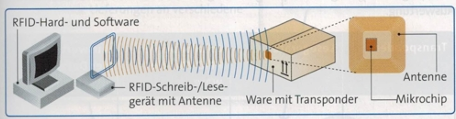

# Vorbereitung KA 29.10.24

## Themen

- 0: Logistik und Lagerlogistik
- 1: Bestellung und Warenannahme
- 2: Warenkontrolle und mangelhafte Lieferung
- 3: Einlagerung von Waren und Codierungen
- 4: RFID-Technik
- 5: Optimierung der Lagerhaltung
- 6: Bestandsarten
- 7: Bestellmengenplanung
- 8: Optimale Bestellmenge
- 9: Probleme im Lager und Lagerkennzahlen

## 0: Logistik und Lagerlogistik

- **Logistik**
  -> ... beschreibt übergreifend die **strategischen** und **operativen** Prozesse in einem Unternehmen, um den Waren-, Informations- und/oder Ressourcenfluss sicherzustellen. Hierbei wird in der Regel versucht, die **Effizienz** und die **Qualität** so hoch wie möglich und die **Kosten** so gering wie möglich wie möglich zu halten.

- **strategische Prozesse**
  -> ... beschreiben alle Prozesse für die **langfristigen** **Planungen** in einem Unternehmen. 
  Dazu zählt zB. die **Standortplanung**, die **Wahl** **des** **Lieferanten** oder **Technologieinvestitionen**.

- **operative** **Prozesse**
  -> ... beschreiben Prozesse in **alltäglichen** **Abläufen** **und** **Aktivitäten**. 
  Beispiele hierfür wären zB. **Bestandsmanagement**, **Verpackung** oder **Qualitätsmanagement**.

- **Lagerlogistik**
  -> ... beschreibt den Teilbereich der Logistik, der für den optimalen **Warenfluss** und die **Platzverwaltung** im Lager zuständig ist.
  Hierzu zählen **Bestandskontrollen**, **Erfassung im Wareneingang** oder effizientes **Verstauen der Materialien**.

- Tätigkeiten in der Lagerlogistik
  

## 1: Bestellung und Warenannahme

- **Kaufvertrag**
  -> Das vollständige Abschließen eines Kaufvertrages setzt in jedem Fall eine **bindende Willenserklärung (Antrag und Annahme)** beider Vertragspartner voraus.
  Im Fall eines privaten Kaufes macht idR. Der Verkäufer ein Angebot, zu welchen Konditionen ein bestimmtest Produkt angeboten wird (Antrag).
  Der Käufer willigt anschließend ein, dass Produkt zum angegebenen Preis zu erwerben (Annahme) und der Kaufvertrag ist abgeschlossen.
  Im Fall eines Unternehmens geht der Antrag häufig vom Käufer aus. Dieser Bestellt beim Lieferanten zu zuvor vereinbarten Konditionen das Produkt. Mit der Annahme der Bestellung vom Verkäufer ist auch hier der Kaufvertrag abgeschlossen.
  **Wichtig**: Ändert eine der Seiten in diesem Fall die vorab vereinbarten Konditionen, dann bedarf es ein weiteres Mal die Einwilligung beider Vertragspartner!
  

- **Warenannahme**
  -> Erst wenn der Käufer die Ware angenommen hat, ist der Kaufvertrag vollständig abgeschossen. Während es für Privatkunden möglich ist, innerhalb der **Gewährleistung** eventuelle Mängel an einer Lieferung geltend zu machen, muss dies bei geschäftlichen Kunden **unverzüglich** geschehen.
  Es ist daher für Unternehmen essentiell eine Lieferung vor der Annahme auf Mängel zu prüfen.

  
  
  

## 2: Warenkontrolle und mangelhafte Lieferung

- **Stichprobenkontrollen**
  -> ... sind sehr effizient um große Lieferungen mit möglichst geringem Zeit- und Kostenaufwand zu prüfen.
  Sie sind sinnvoll, bei sehr großen Mengen oder Waren bei denen nur mit geringer Wahrscheinlichkeit Mängel auftreten.
  Beispiele wären elektronische oder mechanische Bauteile. Bei der Stichprobenkontrolle besteht allerdings das Risiko, dass eine Fehlerhafte Charge unentdeckt bleibt da die gewählten Proben in ihrer Anzahl oder Auswahl nicht repräsentativ genug sind.

- **Vollständige Prüfungen**
  -> ... sind vor allem bei sicherheitskritischen oder fehleranfälligen Produkten sinnvoll.
  In zB. der Medizin- oder Automobilbranche, kann die Weiterverarbeitung auch nur eines einzigen fehlerhaften Teils fatale Auswirkungen haben.
  Da diese Art der Kontrolle sehr kosten- und zeitaufwendig werden kann, wird sie idR. nur auf besonders kritische Produkte beschränkt und nicht Unternehmensweit angewendet.

- **Gewährleistung**
  -> ... beschreibt eine **gesetzlich vorgeschriebene** Frist von **2 Jahren**, in der der Verkäufer für Mängel am Produkt haftet, die vor der Übergabe an den Käufer bestanden. Die Gewährleistung gilt **nur für Privatkunden**! 

- **Garantie**
  -> ... beschreibt eine **freiwillige Leistung** des Verkäufers, individuell vertraglich definierte Mängel am Produkt über die gesetzliche Gewährleistung hinaus zu beseitigen.  

- **Kulanz**
  -> ... beschreibt die **freiwillige Leistung** des Verkäufers, nach **Ablauf von Gewährleistung und Garantie**, weitere Mängel am Produkt zu beseitigen oder Reparaturen durchzuführen.

### Verhalten im Fall eines Mangels (Unternehmen)

1. **Mängelrüge**
   - Der Käufer sollte einen Mangel am Produkt oder einer Lieferung umgehend schriftlich rügen, also dem Verkäufer mitteilen.
     Abhängig von den zuvor festgelegten Vertragsbedingungen, legt der Käufer hier eine Frist (zB. 14 Tage) fest, in welcher der Verkäufer reagieren muss.

2. **Nacherfüllung**
   - Innerhalb der vereinbarten Frist hat der Verkäufer die Möglichkeit der Nachbesserung (Reparatur) oder Ersatzlieferung.
     Schlägt der zweite Nachbesserungsversuch fehl oder ist die Ersatzlieferung in einem unzumutbaren Zustand, kann der Käufer die Nacherfüllung auch ablehnen.

3. **Rücktritt oder Minderung**
   - Wird die Nacherfüllung nicht innerhalb der Frist geleistet oder schlägt fehl, so kann der Käufer Kaufpreisminderung fordern. Bei erheblichen Mängeln ist es dem Käufer zudem möglich vollständig vom Kaufvertrag zurück zu treten und somit den gesamtem Kaufpreis erstattet zu bekommen.

4. **Schadensersatz**
   - Vor Allem im Fall eines Unternehmen kann aus einer mangelhaften Lieferung zudem ein wirtschaftlicher Schaden entstehen. In diesem Fall hat der Käufer zudem Anspruch auf **Schadensersatz**. Dies kann passieren wenn die gelieferte Ware anderweitig zu einem erhöhten Preis erworben werden musste oder die verzögerte Lieferung Produktionsausfälle zur Folge hatte.

## 3: Einlagerung von Waren und Codierungen

### Schritte bei der Einlagerung
- **Erstellung eines Wareneingangsscheins**
  -> Artikel, Anzahl, Datum etc. wird im System festgehalten

- **Bildung logischer Einheiten**
  -> Die angelieferte Ware wird in zuvor festgelegten Einheiten eingelagert. Je nach Artikel kann diese per Anzahl, Gewicht oder Volumen definiert sein.

- **Kennzeichnung**
  -> Jede Ware oder logische Einheit wird zur späteren Identifizierung mit einer Wareneingangsnummer versehen. Diese wird anschließend in Form zB. eines Barcodes auf den Artikel gedruckt oder geklebt.

- **Bestandserfassung**
  -> Die eingelagerte Ware wird dem mit aktuellen Gesamtbestand der Ware im Lager addiert.

- **Freigabe und Transport**
  -> ... der neu angelieferten Waren zum vorgesehenen Lagerort bzw. in das vorgesehene Lager

### Codierung

Zur besseren Nachverfolgung wird jede Ware im Lager mit einer Nummer versehen und diese auch physisch auf der Ware angebracht. Damit diese Nummer möglichst automatisiert eingelesen werden kann, erfolgt dies häufig in Form eines Barcodes.
Es gibt verschiedene Systeme um eine Zahlenkombination als Barcode zu exportieren ([Tabelle mit Codierungen](<../24.09.10/3 Tabelle mit Codierungen.docx>)), zB. GTIN, GS1-Presscode oder Code 128. Bei nahezu allen dieser Codierungen werden die Zahlen zuvor in Binär umgewandelt, um sie mit kurzen und breiten Strichen (1 und 0) darzustellen. Anschließend werden die Nummern mit einer Prüfziffer versehen.
Die Prüfziffer wird aus den vorangegangenen Ziffern berechnet. Anschließend gleicht das Lesegerät die berechnete Nummer mit der tatsächlichen Prüfziffer auf dem Barcode ab, um sicherzustellen das die restliche Zahl korrekt gelesen wurde.

Im Fall von 'Data Matrix Codes' wie dem QR-Code (Quick Response), ist es durch diese Prüfziffern möglich, große Teile des QR-Codes aus der Prüfsumme heraus wiederherzustellen. Dies ist möglich, da die Prüfziffer mehrfach auf QR-Code hinterlegt ist und sich so von der Prüfziffer auf die tatsächliche Information rückschließen lässt.

## 4: RFID-Technik

RFID (Radio Frequency Identification) ermöglicht die Identifizierung von Waren, bzw. das Lesen der Warennummer ohne direkten Sichtkontakt zum Objekt.

Hierzu sendet ein Lesegerät elektromagnetische Wellen aus, die via Induktion einen kleinen Stromkreis in dem RFID-Etikett anstoßen. Diese Schwächt anschließend das Magnetfeld des Lesegerätes auf eine Solche Weise, dass es dadurch die Warennummer herleiten kann (ähnlich wie Morsecode)

Mit der RFID-Technik ist es so möglich, eine sehr große Anzahl an Waren, auf einmal einzulesen, ohne direkten Sichtkontakt mit dem Lesegerät sicherzustellen.

## 5: Optimierung der Lagerhaltung

## 6: Bestandsarten 